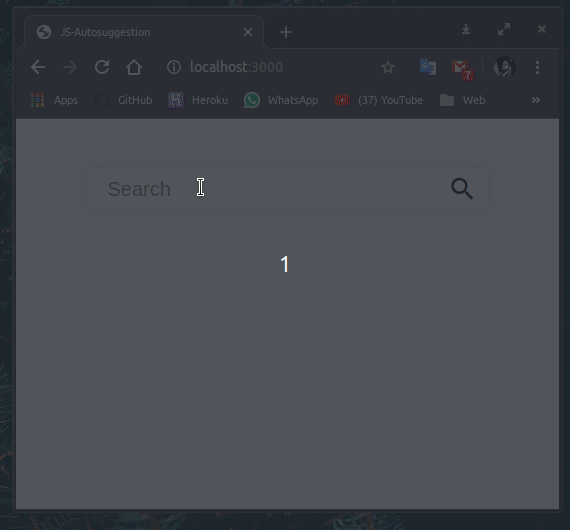

# Javascript Autosuggestion
Simple javascript for autosuggest search bar, this searchbar only suggest cities around the world.
# Preview

live demo [Autosuggest](https://js-autosuggestion.herokuapp.com/).

# Usage
The main data file is cities.js where store all the cities name. You can use your files insteed of cities.

Run the file name server.js and then open localhost:3000 on your brower

    # node server.js
          or
    # npm run devStart
    
